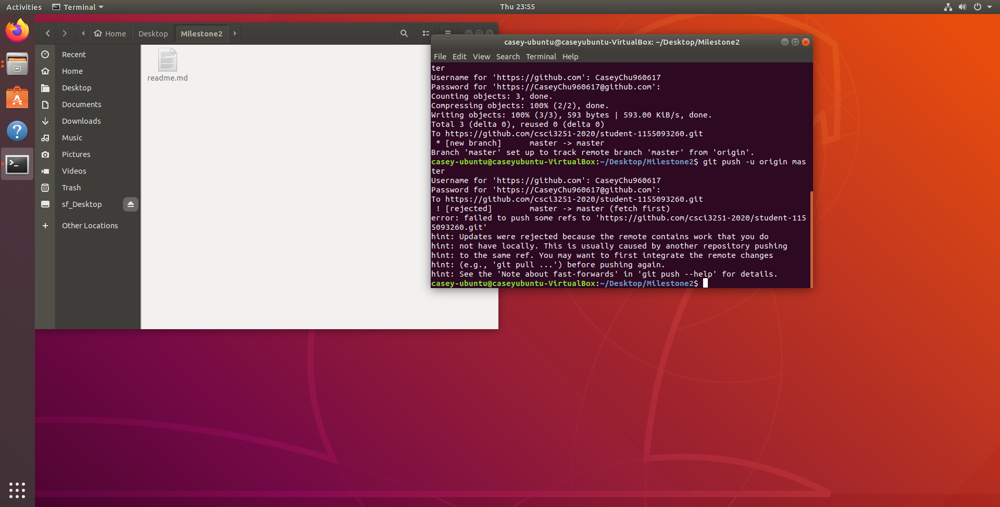

# Developer Info

My name is **Chu Kai Chun, Casey**. 

I am a year 2 CS student.

I have been learning programming since last year.

I am a new beginner to GitHub.

## Programming languages:

- C
- Java
- Python (a bit)

## To do list everyday:

- [ ] Sleep
- [ ] Play video games
- [ ] Play piano

- [x] Eat
- [x] Study
- [x] Watch Youtube
- [x] Listen to music

## To do list in summer vacation:

| Things to do:                    |
| -------------------------------- |
| Learn  JavaScript/HTML           |
| Start app development on Android |
| Leanr Python/C#                  |
| Make gundam models               |
| Watch TVDramas                   |
| Play piano                       |
| Study History                    |

# Screenshot <h4>

